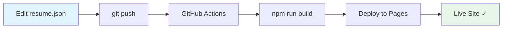

# npuliga.github.io — Personal Portfolio

Premium portfolio website for **Naga Puligadda**, built with [Astro](https://astro.build) and deployed automatically to GitHub Pages.

**🌐 Live site:** [npuliga.github.io](https://npuliga.github.io)

---

## 📖 Documentation

**New to this project?** We have comprehensive documentation for absolute beginners!

### Quick Start
- 🚀 **[Getting Started Guide](docs/guides/GETTING_STARTED.md)** — Installation, setup, first run
- ✏️ **[Editing Guide](docs/guides/EDITING_GUIDE.md)** — How to update resume content, change styles
- 🚢 **[Deployment Guide](docs/guides/DEPLOYMENT_GUIDE.md)** — Deploy to GitHub Pages, Vercel, Netlify, Cloudflare

### Technical Documentation
- 🏗️ **[Technology Overview](docs/architecture/TECHNOLOGY_OVERVIEW.md)** — What Astro is, why we use it, architecture
- 📂 **[Project Structure](docs/architecture/PROJECT_STRUCTURE.md)** — Every file and folder explained
- 📊 **[Architecture Diagrams](docs/architecture/DIAGRAMS.md)** — Sequence diagrams, data flow, build process

### Help & Support
- 🆘 **[Troubleshooting Guide](docs/guides/TROUBLESHOOTING.md)** — Common errors and how to fix them
- 📚 **[Full Documentation Index](docs/README.md)** — Complete table of contents

---

## What is this?

A fully static, high-performance personal portfolio site that transforms resume data into a visually compelling presentation. Update a single JSON file, push to GitHub, and the site rebuilds and deploys automatically.

**Key features:**
- ✨ Premium, minimal design (Linear/Stripe-inspired)
- 🌓 Dark/light theme toggle with persistence
- 📱 Fully responsive (mobile, tablet, desktop)
- 🔍 SEO optimized (Open Graph, Twitter cards, JSON-LD)
- 🖨️ Print-friendly stylesheet
- ⚡ Zero backend — fully static
- 🎬 Scroll animations with IntersectionObserver
- 🚀 < 1 second load time
- 🎓 **48 Credly certifications** from Red Hat and O'Reilly Media

---

## Quick Reference

### Update Resume Content

**All resume data lives in one file:** `src/data/resume.json`

```bash
# 1. Edit the file
code src/data/resume.json

# 2. Test locally
npm run dev

# 3. Deploy
git add .
git commit -m "Update resume"
git push origin master
```

**Detailed guide:** [Editing Guide](docs/guides/EDITING_GUIDE.md)

### Change Visual Design

**All styles in one file:** `src/styles/global.css`

```css
/* Change accent color */
:root {
  --color-accent: #0066cc;  /* Change this! */
}
```

**Detailed guide:** [Editing Guide → Changing Styles](docs/guides/EDITING_GUIDE.md#editing-styles)

---

## Architecture Overview

```
npuliga.github.io/
├── src/
│   ├── data/
│   │   └── resume.json          ← YOUR RESUME DATA (edit this!)
│   ├── components/              ← UI building blocks
│   │   ├── Navigation.astro
│   │   ├── Hero.astro
│   │   ├── KeyImpact.astro
│   │   ├── Experience.astro
│   │   ├── CaseStudies.astro
│   │   ├── Skills.astro
│   │   ├── Leadership.astro
│   │   ├── Education.astro      (Displays 48 Credly badges!)
│   │   └── Contact.astro
│   ├── layouts/
│   │   └── Layout.astro         ← HTML shell, SEO meta
│   ├── pages/
│   │   └── index.astro          ← Main page
│   └── styles/
│       └── global.css           ← All styling
├── docs/                        ← COMPREHENSIVE DOCUMENTATION
│   ├── guides/                  (Beginner-friendly tutorials)
│   ├── architecture/            (Technical deep-dives)
│   └── README.md                (Documentation index)
├── public/
│   └── favicon.svg
├── .github/workflows/
│   └── deploy.yml               ← Auto-deploy on push
├── astro.config.mjs
└── package.json
```

**Full structure explained:** [Project Structure Guide](docs/architecture/PROJECT_STRUCTURE.md)

---

## Tech Stack

| Layer | Technology | Why? |
|-------|-----------|------|
| **Framework** | [Astro 5.7.10](https://astro.build) | Zero JS, fast builds, SSG |
| **Styling** | Custom CSS | Full control, design tokens |
| **Fonts** | Inter (Google Fonts) | Professional, readable |
| **Data** | JSON | Single source of truth |
| **Hosting** | GitHub Pages | Free, auto-deploy |
| **CI/CD** | GitHub Actions | Automated builds |

**Deep dive:** [Technology Overview](docs/architecture/TECHNOLOGY_OVERVIEW.md)

---

## Setup (First-Time Users)

### Prerequisites

1. **Git**: Download from [git-scm.com](https://git-scm.com/downloads)
2. **Node.js** (v18+): Download from [nodejs.org](https://nodejs.org/)
3. **Code Editor**: [VS Code](https://code.visualstudio.com/) (recommended)

Verify installation:
```powershell
git --version    # Should show: git version 2.x.x
node --version   # Should show: v18.x.x or higher
npm --version    # Should show: 9.x.x or higher
```

### Installation

```powershell
# Clone the repository
git clone https://github.com/npuliga/npuliga.github.io.git
cd npuliga.github.io

# Install dependencies
npm install

# Start development server
npm run dev
```

**Open browser:** [http://localhost:4321](http://localhost:4321)

**Full setup guide:** [Getting Started](docs/guides/GETTING_STARTED.md)

---

## Common Commands

```powershell
npm run dev       # Start dev server (http://localhost:4321)
npm run build     # Build production site (creates dist/)
npm run preview   # Preview production build locally
```

---

## Deployment Flow



**Push to master branch → Site auto-deploys in ~2 minutes**

**Full deployment guide:** [Deployment Guide](docs/guides/DEPLOYMENT_GUIDE.md)

---

## Common Issues & Quick Fixes

| Problem | Quick Fix | Full Guide |
|---------|-----------|------------|
| `npm install` fails | Ensure Node.js 18+ installed | [Troubleshooting](docs/guides/TROUBLESHOOTING.md#installation-issues) |
| Changes don't appear | Hard refresh: `Ctrl+Shift+R` | [Troubleshooting](docs/guides/TROUBLESHOOTING.md#site-works-but-changes-dont-appear) |
| JSON syntax error | Use [jsonlint.com](https://jsonlint.com/) | [Troubleshooting](docs/guides/TROUBLESHOOTING.md#json-syntax-errors) |
| Build fails on GitHub | Check Actions tab for logs | [Troubleshooting](docs/guides/TROUBLESHOOTING.md#github-actions-build-fails) |
| 404 on GitHub Pages | Verify Pages source is "GitHub Actions" | [Troubleshooting](docs/guides/TROUBLESHOOTING.md#error-404-page-not-found) |

**Complete troubleshooting:** [Troubleshooting Guide](docs/guides/TROUBLESHOOTING.md)

---

## Features Highlight

### Resume Data Model

**48 professional certifications** from Credly (Red Hat & O'Reilly Media):
- 7 Red Hat Professional Certifications (RHCA, RHCE, RHCSA, Specialists)
- 34 Red Hat Course Completions (DO/RH/CL/AD/CS series)
- 7 O'Reilly Media Courses (AWS, Kubernetes, Containers)
- 4 Legacy Certifications (Chef, IBM, Akamai, ITIL)

**Structured resume sections:**
- Personal info & contact
- Hero section with stats
- 6 key impact metrics
- 10 work experience entries
- 4 deep-dive case studies
- 8 skill categories
- 4 leadership dimensions
- 2 degrees + certifications
- Contact links

### Design System

**Design Tokens:**
- Color system (light/dark themes)
- Spacing scale (4px → 48px)
- Typography scale
- Border radius system
- Shadow system

**Responsive Breakpoints:**
- Mobile: < 640px
- Tablet: 640px - 768px
- Desktop: > 768px

### Performance

- **Load time**: < 1 second
- **Page size**: ~30KB HTML + CSS
- **JavaScript**: 0 bytes (optional theme toggle)
- **Build time**: ~900ms
- **Lighthouse scores**: 95-100 across all metrics

---

## Project Stats

- **Total Lines of Code**: ~2,500 lines
  - Components: 9 Astro components
  - Styling: ~800 lines CSS
  - Data: ~310 lines JSON
  - Documentation: ~25,000 words
- **Dependencies**: 1 (Astro framework)
- **Build Output**: Static HTML + minified CSS
- **Supported Browsers**: All modern browsers (Chrome, Firefox, Safari, Edge)

---

## Screenshots

**Light Theme**


**Dark Theme**


*(Visit [npuliga.github.io](https://npuliga.github.io/) to see it live)*

---

## Contributing

This is a personal portfolio site, but if you find bugs or have suggestions:

1. Open an issue on GitHub
2. Submit a pull request
3. Contact via email: contactpuligadda@gmail.com

---

## License

MIT License - feel free to use this as a template for your own portfolio!

---

## Documentation Credits

Comprehensive beginner-friendly documentation created to help anyone—regardless of technical background—get started with this project. Includes:

- ✅ Step-by-step installation guides
- ✅ JSON editing tutorials with examples
- ✅ CSS customization walkthroughs
- ✅ Deployment guides for 4 hosting platforms
- ✅ 8 sequence/architecture diagrams (Mermaid)
- ✅ Troubleshooting for 20+ common errors
- ✅ Complete file-by-file code walkthrough

**Total documentation**: 7 comprehensive guides, ~25,000 words

**Start here**: [Documentation Index](docs/README.md)

---

## Contact

**Naga Puligadda**  
📧 Email: contactpuligadda@gmail.com  
💼 LinkedIn: [linkedin.com/in/naga.puligadda](https://www.linkedin.com/in/naga.puligadda/)  
🐙 GitHub: [github.com/npuliga](https://github.com/npuliga)  
🏆 Credly: [credly.com/users/naga-puligadda](https://www.credly.com/users/naga-puligadda)

---

**Built with ❤️ using Astro**


## 🎤 Public Speaking
    
### Recent Appearances

- **Women TechMakers Vienna Conference** _(streamed on Aug 7, 2020)_
<br>[How AI is Enhancing Journalism](https://www.youtube.com/watch?v=-qZCRHwnnbM)<br>

- **DevDiscuss Podcast** _(released on Dec 9, 2020)_
<br>[Improving Your Onboarding For Early Career Devs](https://dev.to/devteam/improving-your-onboarding-for-early-career-devs-with-carolyn-stransky-john-britton-2ec3)<br>
<br>

**Want me to speak at your event?**
<br>💖 [Check out my website](https://workwithcarolyn.com/speaking) for more information.
<br><br>
  
## 🏆 Accomplishments

**Top Author Recognition** @ [DEV](https://dev.to/) _(2019 - 2020)_ <br>
Named one of the Top 500 authors in 2019. Also wrote two articles that ranked in the weekly Top 7:
  - [How to remove condescending language from documentation](https://dev.to/meeshkan/how-to-remove-condescending-language-from-documentation-4a5p)
  - [Onboarding a junior developer to your team? Here's 12 tips.](https://dev.to/carolstran/onboarding-a-junior-developer-to-your-team-here-s-12-tips-4g3a)
<br><br>

**Won Best Project** @ [Geek Girl Carrots Berlin Hackathon](http://www.hacklikeagirl.co/) _(Oct 2017)_<br>
Created [Qarma](https://github.com/lcorr8/qarma), an online platform to report and retrieve lost & found objects for travelers abroad.
<br><br>

## 💬 Languages

**English**: Native <br>
**German**: A2.2
<br><br>

## 👩🏼‍🎓 Education

**12-week intensive coding course** focused on full-stack JavaScript<br>
[SPICED Academy](https://www.spiced-academy.com/) - Berlin, Germany _(Apr 2017 - Jun 2017)_ <br>

**Bachelor of Arts** in Journalism and Media Studies<br>
[Beloit College](https://www.beloit.edu/) - Beloit, Wisconsin, USA _(2011 - 2015)_

**Washington Semester Program** for Journalism and New Media<br>
[American University](https://www.american.edu/) - Washington DC, USA _(Fall 2014)_

**International Exchange** studying Political Science<br>
[Yeditepe Üniversitesi](https://yeditepe.edu.tr/en) - Istanbul, Turkey _(Spring 2013)_
